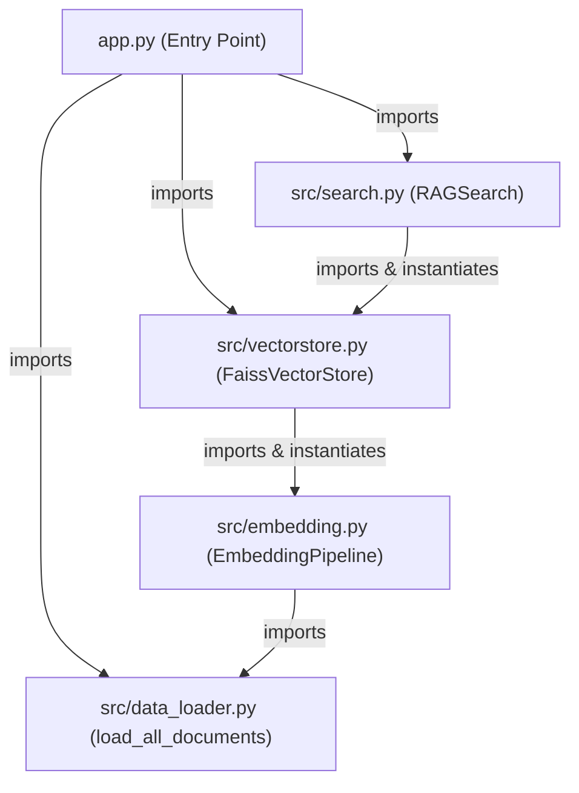
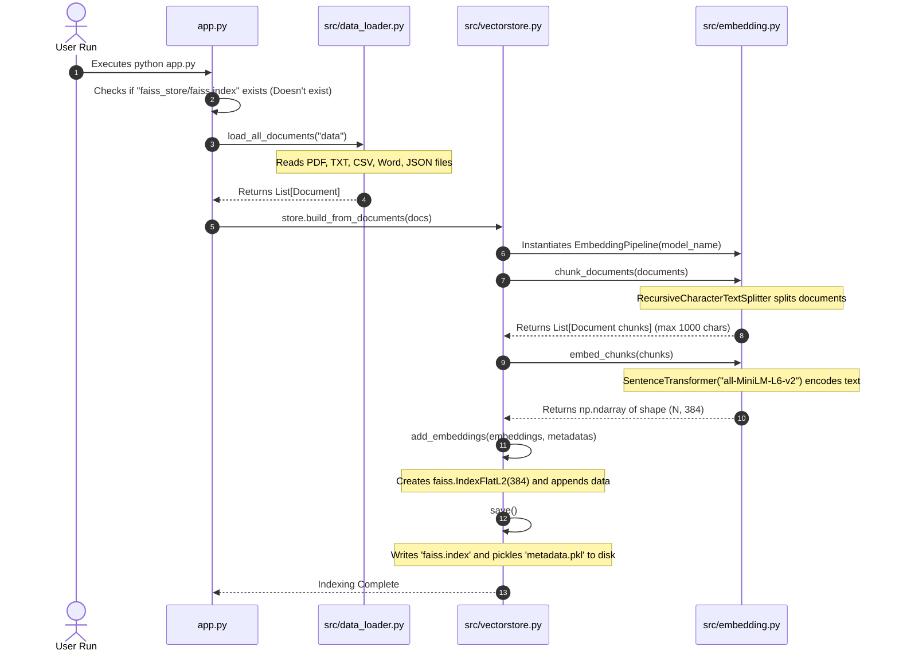
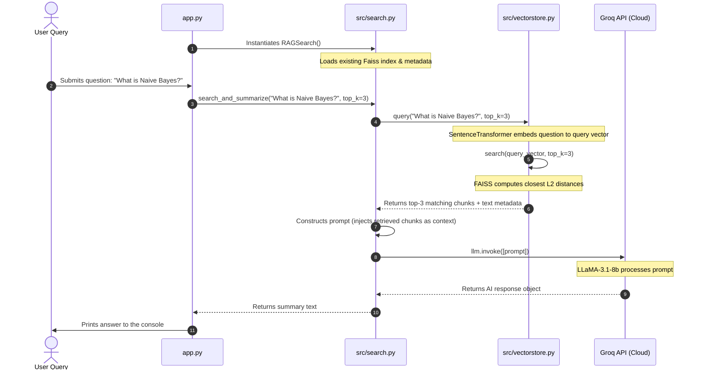

# 🗺️ RAG Practice Codebase Connection & Workflow Guide

This document explains the complete, end-to-end workflow of your **Retrieval-Augmented Generation (RAG)** system. It shows exactly how the different classes and functions in your codebase import, instantiate, and call each other to load documents, create vector indexes, search, and generate answers.

---

## 📌 Architecture Directory & Import Map

Understanding who depends on whom is the key to understanding the workflow. Here is the import relationship between files:



* **`app.py`** is the master orchestrator that triggers either the **Indexing (Setup)** or **Query (Interactive Chat)** phase.
* **`src/search.py`** handles the runtime RAG query loop, calling `FaissVectorStore` for vector matches and passing context to the Groq API LLM.
* **`src/vectorstore.py`** wraps the FAISS search engine and delegates text-chunking and numerical vectorization to `EmbeddingPipeline`.
* **`src/embedding.py`** manages local HuggingFace `SentenceTransformer` vectorization and splits raw texts using LangChain's splitters.
* **`src/data_loader.py`** contains utility functions to parse multi-format documents (PDF, CSV, Word, JSON, etc.) into unified LangChain `Document` objects.

---

## 🔄 Phase 1: Document Ingestion & Indexing (The Setup Flow)

This phase runs the **first time** you start the application (or when you delete the `faiss_store/` directory to rebuild it). It parses files, generates numerical vectors representing their meanings, and persists the database to disk.

### 🎬 Sequence Call Diagram (Indexing Phase)



### 🔍 Detailed Step-by-Step Code Walkthrough

#### Step 1: The Initial Check
In `app.py`, the system determines whether it needs to build a database or load an existing one:
```python
store = FaissVectorStore("faiss_store")
faiss_path = "faiss_store/faiss.index"

if not os.path.exists(faiss_path):
    docs = load_all_documents("data")       # Build pipeline
    store.build_from_documents(docs)
else:
    store.load()                            # Load pipeline
```

#### Step 2: Document Loading
If the index is not found, `app.py` calls the function `load_all_documents("data")` from `src/data_loader.py`.
* This function scans the `data/` directory.
* Based on extensions, it creates specific loaders:
  * `.pdf` ➡️ `PyPDFLoader`
  * `.txt` ➡️ `TextLoader`
  * `.csv` ➡️ `CSVLoader`
  * `.xlsx` ➡️ `UnstructuredExcelLoader`
  * `.docx` ➡️ `Docx2txtLoader`
  * `.json` ➡️ `JSONLoader`
* Each loader parses the files and generates standard LangChain `Document` structures containing `page_content` (the text) and `metadata` (source properties).
* It aggregates them all and returns a `List[Document]`.

#### Step 3: Vector Store Ingestion
`app.py` passes this list of documents to `store.build_from_documents(docs)` inside `src/vectorstore.py`.
1. **Instantiation**: Inside `build_from_documents()`, the store instantiates `EmbeddingPipeline` dynamically:
   ```python
   emb_pipe = EmbeddingPipeline(model_name=self.embedding_model, chunk_size=self.chunk_size, chunk_overlap=self.chunk_overlap)
   ```
2. **Text Chunking**: The store calls `chunks = emb_pipe.chunk_documents(documents)`.
   * Under the hood, `EmbeddingPipeline` uses `RecursiveCharacterTextSplitter` to cut the documents into chunks (e.g., maximum 1000 characters, with 200 overlapping characters).
   * Splitting is done sequentially on double newlines (`\n\n`), single newlines (`\n`), spaces (` `), and characters to keep text paragraphs intact.
   * A new list of chunked `Document` objects is returned.
3. **Numerical Vectorization**: The store calls `embeddings = emb_pipe.embed_chunks(chunks)`.
   * `EmbeddingPipeline` extracts the text contents from each chunk (`[chunk.page_content for chunk in chunks]`).
   * It feeds them to the HuggingFace `SentenceTransformer("all-MiniLM-L6-v2")` model running locally.
   * The model outputs a high-dimensional vector array (`np.ndarray` of shape `[N, 384]`), where `N` is the number of chunks, and each chunk is represented by 384 numbers.
4. **Index Insertion**: The store converts the embeddings into `float32` (required by FAISS) and runs `self.add_embeddings(embeddings, metadatas)`.
   * It instantiates a `faiss.IndexFlatL2(384)` index.
   * `self.index.add(embeddings)` adds the mathematical vectors into the FAISS search space.
   * The actual plain-text of the chunks is saved in `self.metadata` in parallel.
5. **Persistence**: The store calls `self.save()`.
   * It writes the mathematical index structure into the binary file `faiss_store/faiss.index`.
   * It pickles the corresponding array of texts into `faiss_store/metadata.pkl`.

---

## 💬 Phase 2: Similarity Search & LLM Generation (The Query Flow)

This phase runs in the interactive terminal loop. It accepts a natural language question from the user, retrieves the most similar text chunks, and sends them to Groq's cloud LLaMA-3.1 model to construct a factual response.

### 🎬 Sequence Call Diagram (Query Phase)



### 🔍 Detailed Step-by-Step Code Walkthrough

#### Step 1: Initializing RAG Search
In `app.py`, once the main block starts, it instantiates `RAGSearch()` from `src/search.py`:
```python
rag_search = RAGSearch()
```
Inside the `RAGSearch.__init__` constructor:
* It instantiates `self.vectorstore = FaissVectorStore(persist_dir, embedding_model)`.
* It calls `self.vectorstore.load()` to read `faiss_store/faiss.index` and `faiss_store/metadata.pkl` into memory.
* It grabs the `GROQ_API_KEY` from the environmental variable.
* It instantiates the client connection for the cloud LLM using:
  ```python
  self.llm = ChatGroq(model_name="llama-3.1-8b-instant", api_key=groq_api_key)
  ```

#### Step 2: Running the Retrieval
When the user submits a prompt, `app.py` calls `summary = rag_search.search_and_summarize(query, top_k=3)`.
* `RAGSearch` immediately triggers `results = self.vectorstore.query(query, top_k=top_k)`.
* Inside `FaissVectorStore.query()`:
  * The store uses its local `SentenceTransformer` to encode the query string into a single 384-dimensional vector.
  * It passes this query vector to `self.search(query_emb, top_k=top_k)`.
  * Inside `self.search()`:
    * The vector index performs the search: `D, I = self.index.search(query_embedding, top_k)`.
    * FAISS calculates the mathematical Euclidean distance between the query vector and all chunk vectors in memory.
    * It returns `I` (the index locations of the top-3 closest vectors) and `D` (their distance metrics).
    * The method matches these index locations to `self.metadata[idx]` to retrieve the actual plain-text of those document chunks.
    * It returns the matches as a list of dictionary metadata objects.

#### Step 3: Synthesis with the LLM
`RAGSearch.search_and_summarize()` processes the returned matching results:
1. **Context Extraction**: It extracts text snippets from the results and joins them into a single string:
   ```python
   texts = [r["metadata"].get("text", "") for r in results if r["metadata"]]
   context = "\n\n".join(texts)
   ```
2. **Prompt Engineering**: It builds a prompt layout, feeding the retrieved document snippets as grounding truth:
   ```text
   Summarize the following context for the query: 'What is Naive Bayes?'

   Context:
   [Text chunk 1 from Machine_Learning_Basics.pdf]
   [Text chunk 2 from machine_learning.txt]
   [Text chunk 3 from Machine_Learning_Basics.pdf]

   Summary:
   ```
3. **LLM Execution**: It sends the prompt to the cloud model:
   ```python
   response = self.llm.invoke([prompt])
   ```
   The LLaMA-3.1 model interprets the instructions and generates a concise summary grounded strictly in the provided contexts.
4. **Output return**: The method returns `response.content` back to the console loop in `app.py` to be printed.

---

## 🎛️ Integration Matrix: Functions & Classes Connections

The table below catalogs every custom class and function in your project, showing exactly who invokes it, what arguments it takes, and what it returns to the caller.

| File | Class / Function | Called By | Input Arguments | Returns | Purpose |
| :--- | :--- | :--- | :--- | :--- | :--- |
| **`src/data_loader.py`** | `load_all_documents` | `app.py` | `data_dir: str` | `List[Document]` (LangChain) | Scans local folders and parses PDF, Word, TXT, Excel, JSON files into standard objects. |
| **`src/embedding.py`** | `EmbeddingPipeline` | `FaissVectorStore` (in `build_from_documents`) | `model_name: str`, `chunk_size: int`, `chunk_overlap: int` | `EmbeddingPipeline` instance | Handles text chunking and vector embedding generation. |
| | `chunk_documents` | `FaissVectorStore` | `documents: List[Document]` | `List[Document]` (split chunks) | Splits long text pages into small paragraphs with overlap to maintain contexts. |
| | `embed_chunks` | `FaissVectorStore` | `chunks: List[Document]` | `np.ndarray` (size `[N, 384]`) | Vectorizes text chunks into numbers using HuggingFace sentence transformer models. |
| **`src/vectorstore.py`** | `FaissVectorStore` | `app.py`, `RAGSearch` | `persist_dir: str`, `embedding_model: str`, `chunk_size: int`, `chunk_overlap: int` | `FaissVectorStore` instance | Wraps Facebook's FAISS library to build, search, load, and save semantic indexes. |
| | `build_from_documents`| `app.py` | `documents: List[Document]` | `None` (Saves files to disk) | Directs the chunking, embedding generation, index additions, and disk persistence. |
| | `add_embeddings` | `build_from_documents` | `embeddings: np.ndarray`, `metadatas: List[Any]` | `None` | Places numerical vectors into the L2 FAISS index structures and tracks texts. |
| | `save` | `build_from_documents` | None | `None` (Writes files) | Serializes the index to binary files and metadata arrays to pickle files. |
| | `load` | `app.py`, `RAGSearch` | None | `None` (Loads in-memory) | Deserializes existing binary indexes and pickled arrays from disk. |
| | `query` | `RAGSearch` | `query_text: str`, `top_k: int` | `List[dict]` (Results with texts) | Embeds a raw user query string, then calls `search()` to fetch the matching items. |
| | `search` | `query` | `query_embedding: np.ndarray`, `top_k: int` | `List[dict]` (Index, distance, texts) | Queries FAISS index arrays and fetches matched text entries from the metadata list. |
| **`src/search.py`** | `RAGSearch` | `app.py` | `persist_dir: str`, `embedding_model: str`, `llm_model: str` | `RAGSearch` instance | Configures the vector store and instantiates the Groq cloud model connection. |
| | `search_and_summarize`| `app.py` | `query: str`, `top_k: int` | `str` (Final answer response text) | The primary RAG method: queries the store, creates LLM prompts, and gets response. |

---

## 🛠️ Code Bridges: How Objects Communicate

Here are the key "bridge" locations in the codebase showing how these separate libraries are stitched together:

### 1. The Document Ingestion Bridge (`src/vectorstore.py`)
In this snippet, `FaissVectorStore` bridges the `data_loader` raw document list with the `EmbeddingPipeline` helper class:
```python
def build_from_documents(self, documents: List[Any]):
    # Bridge to EmbeddingPipeline constructor
    emb_pipe = EmbeddingPipeline(model_name=self.embedding_model, chunk_size=self.chunk_size, chunk_overlap=self.chunk_overlap)
    
    # Bridge to chunking function
    chunks = emb_pipe.chunk_documents(documents)
    
    # Bridge to vector generator function
    embeddings = emb_pipe.embed_chunks(chunks)
    
    # Convert and format data to fit FAISS requirements
    metadatas = [{"text": chunk.page_content} for chunk in chunks]
    self.add_embeddings(np.array(embeddings).astype('float32'), metadatas)
    self.save()
```

### 2. The Semantic Search Bridge (`src/vectorstore.py`)
This snippet shows how text queries are converted into search vectors to run against the compiled FAISS Index:
```python
def query(self, query_text: str, top_k: int = 5):
    # Generates a vector for user query text using the SAME model as the chunks
    query_emb = self.model.encode([query_text]).astype('float32')
    
    # Searches the binary Index using Euclidean similarity math
    return self.search(query_emb, top_k=top_k)
```

### 3. The RAG Prompt Injection Bridge (`src/search.py`)
Here, the text retrieved from semantic search is injected into the LLM prompt to restrict hallucinations:
```python
def search_and_summarize(self, query: str, top_k: int = 5) -> str:
    # Retreives the top matching metadata dictionaries from vectorstore
    results = self.vectorstore.query(query, top_k=top_k)
    
    # Extract plain-text context blocks
    texts = [r["metadata"].get("text", "") for r in results if r["metadata"]]
    context = "\n\n".join(texts)
    
    # Wrap context and user query inside a custom instructions layout
    prompt = f"""Summarize the following context for the query: '{query}'\n\nContext:\n{context}\n\n\n\nSummary:"""
    
    # Send compiled instructions to ChatGroq API client wrapper
    response = self.llm.invoke([prompt])
    return response.content
```
